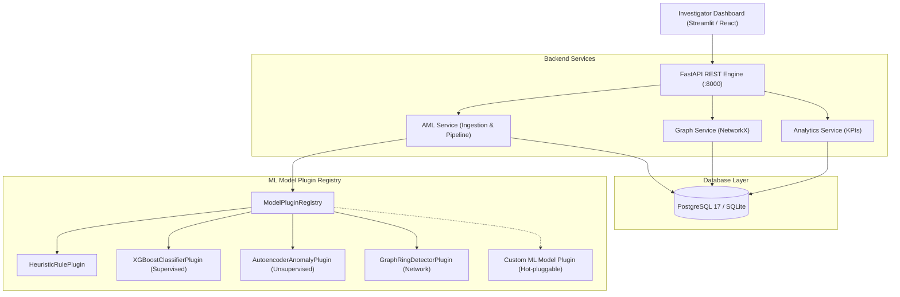

# AML Detection & Graph Analytics Engine — Production Backend

A production-grade, high-performance RESTful backend engineered for **Anti-Money Laundering (AML) Detection** and **Network Graph Analytics**, based on the PaySim transaction schema.

Built with **FastAPI**, **PostgreSQL** (with SQLAlchemy 2.0 ORM), and **NetworkX**, featuring an extensible **Plugin Architecture** that allows machine learning models to be added, swapped, or dynamically reconfigured without modifying core business logic.

---

## 🌟 Key Features

1. **Pluggable ML Model Architecture:**
   - Any ML model (supervised classification, deep autoencoder, graph neural network, or heuristic rule engine) is an isolated plugin inheriting from `BaseAMLModelPlugin`.
   - Models can be enabled, disabled, and re-weighted dynamically via REST APIs at runtime.
   - Multi-model ensemble combines individual predictions into a single calibrated risk score with SHAP-based feature importance.
2. **PostgreSQL & Database Resilience:**
   - Production-ready PostgreSQL schema with high-throughput indices, JSONB storage for explainability matrices, and foreign keys.
   - Automatic development fallback to SQLite if PostgreSQL is not active locally.
   - Complete `docker-compose.yml` for PostgreSQL 17 + backend + pgAdmin 4.
3. **NetworkX Graph Analytics Engine:**
   - On-demand egocentric subgraph extraction up to $N$ hops.
   - Cycle detection identifying circular laundering loops (round-tripping).
   - Detection of structuring/smurfing fan-out patterns.
4. **Investigator Case Management:**
   - Suspicious transactions automatically generate alert cases.
   - Investigator triage workflow (`CONFIRMED_FRAUD`, `FALSE_POSITIVE`, `UNDER_INVESTIGATION`).
   - Immutable audit trail logging all state transitions.
5. **PaySim CSV Dataset Ingestion:**
   - Direct CSV streaming upload endpoint supporting PaySim formatted datasets.

---

## 🏗️ System Architecture



---

## 🔌 How the ML Plugin Architecture Works

To make machine learning models plugins, every model implements the `BaseAMLModelPlugin` contract.

### Creating a New Model Plugin in 15 Lines of Code:
When the ML team (K. Chandana) finishes training a new model, simply add a new file in `app/ml_plugins/plugins/my_new_model.py`:

```python
from app.ml_plugins.base import BaseAMLModelPlugin, ModelType, PluginPrediction

class MyNewAMLModelPlugin(BaseAMLModelPlugin):
    def __init__(self):
        super().__init__(
            name="deep_gnn_model",
            version="1.0.0",
            description="Graph Neural Network for account fraud ranking",
            model_type=ModelType.GRAPH_ANALYTICS,
            is_enabled=True,
            weight=1.0,
            author="K. Chandana",
        )
        # Load your trained model weights here:
        # self.model = joblib.load("models/gnn_model.joblib")

    def predict(self, tx: dict) -> PluginPrediction:
        # Run model inference
        risk = 0.88  # calculated probability
        return PluginPrediction(
            model_name=self.name,
            model_version=self.version,
            model_type=self.model_type,
            risk_score=risk,
            is_suspicious=risk >= 0.50,
            reasons=["High-risk community graph node detected"],
            feature_importance={"graph_degree": 0.45, "amount": 0.35}
        )
```

Register it in `app/ml_plugins/__init__.py`:
```python
from app.ml_plugins.plugins.my_new_model import MyNewAMLModelPlugin
plugin_registry.register(MyNewAMLModelPlugin())
```
That's it! The ensemble risk scorer, database persistence, alerts, and Swagger documentation automatically integrate the new model immediately.

---

## 🚀 Quickstart & Running the Backend

### Option A: Local Development (Instant SQLite / Local Python)

```bash
# 1. Navigate to backend
cd /root/backend

# 2. Seed realistic PaySim AML transactions
python3 scripts/seed_data.py

# 3. Start development server
./scripts/run_dev.sh
```
Open **[http://localhost:8000/docs](http://localhost:8000/docs)** to view the interactive Swagger API documentation.

---

### Option B: Production with Docker Compose (PostgreSQL 17 + pgAdmin)

```bash
cd /root/backend

# Launch PostgreSQL 17, Backend API, and pgAdmin
docker compose up -d --build
```
- **Backend API:** `http://localhost:8000`
- **Swagger Documentation:** `http://localhost:8000/docs`
- **pgAdmin GUI:** `http://localhost:5050` (Email: `admin@aml.local`, Password: `admin`)

---

## 📡 Core API Reference

| Method | Endpoint | Description |
|---|---|---|
| `GET` | `/api/v1/health` | Service health status |
| `GET` | `/api/v1/ready` | Readiness check (DB & active plugins) |
| `POST` | `/api/v1/transactions/` | Ingest single transaction & run ML ensemble scoring |
| `POST` | `/api/v1/transactions/bulk` | Batch transaction ingestion |
| `POST` | `/api/v1/transactions/upload-csv` | Upload and parse PaySim CSV dataset |
| `GET` | `/api/v1/transactions/` | Paginated search with filtering (`type`, `risk_level`, `amount`) |
| `GET` | `/api/v1/transactions/{id}` | Detailed transaction report with SHAP explainability |
| `GET` | `/api/v1/alerts/` | List suspicious transaction alerts for investigator triage |
| `PATCH`| `/api/v1/alerts/{id}` | Update alert status (`CONFIRMED_FRAUD`, `FALSE_POSITIVE`) |
| `GET` | `/api/v1/graph/account/{acc_id}` | Generate NetworkX money-flow graph nodes and edges |
| `GET` | `/api/v1/graph/cycles` | Detect circular laundering loops (round-tripping) |
| `GET` | `/api/v1/plugins/` | List all registered ML model plugins & latency metrics |
| `POST` | `/api/v1/plugins/{name}/toggle` | Hot-toggle an ML model on/off at runtime |
| `POST` | `/api/v1/plugins/{name}/weight` | Update model voting weight in ensemble |
| `GET` | `/api/v1/analytics/dashboard-kpis` | Aggregated dashboard KPI metrics (precision, recall, volume) |

---

## 🧪 Testing

The backend includes a comprehensive `pytest` test suite:

```bash
cd /root/backend
python3 -m pytest tests -v
```

All 14 tests cover:
- Health and readiness probes
- Dynamic plugin hot-toggling and custom plugin registration
- Single, bulk, and CSV transaction ingestion
- Suspicious transaction alert auto-generation
- Investigator triage and audit trail logging
- NetworkX graph generation and circular cycle detection
